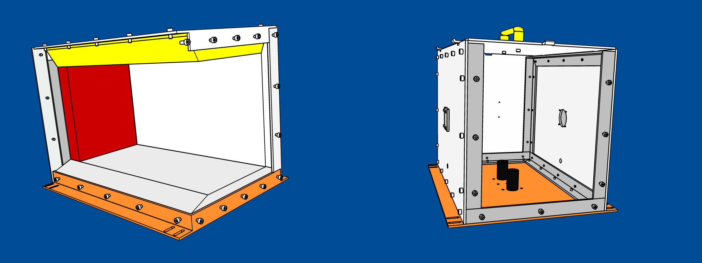
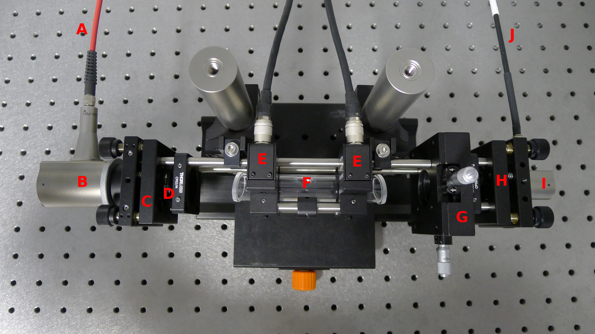
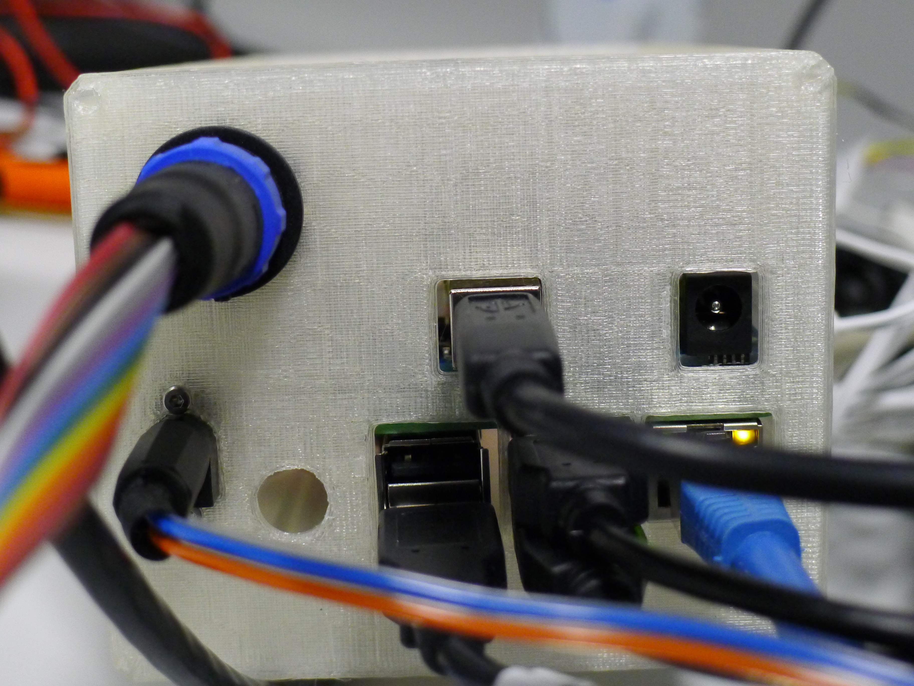

# TheBox-controller
Some very old code poorly written. Made to control the Box Experiment.

## Pictures
General view of TheBox itself

Interior of the TheBox with optical assembly

<aside class="warning">
This is old code, it is more likely it will not work but some of it might be helpful
</aside>
